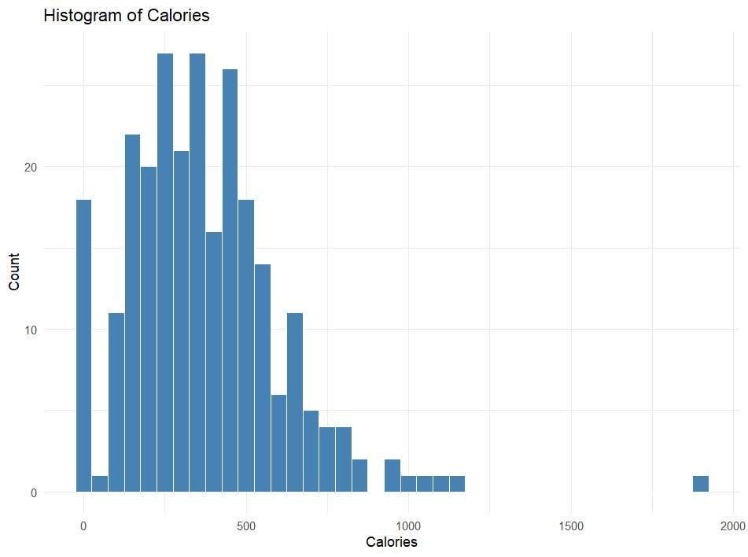
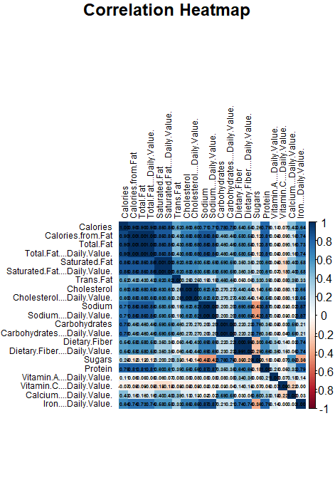
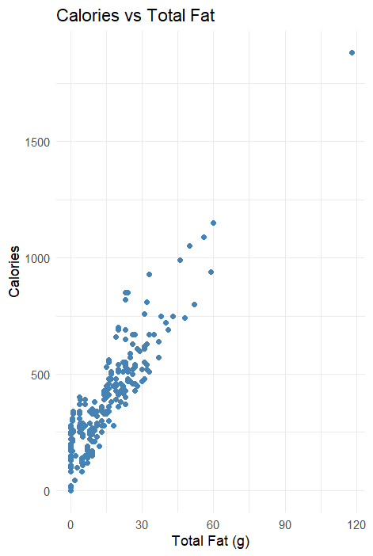

# 🍔 McDonald's Nutrition Facts — Exploratory Data Analysis

**Tools:** R, ggplot2, corrplot

## Project Overview
This project performs a full exploratory data analysis (EDA) on McDonald's 
nutrition data (260 menu items, 21 numeric features) to uncover which 
nutrients most strongly predict calorie content.

## Key Findings
- **Total Fat** (r = 0.904) and **Saturated Fat** (r = 0.848) are the 
  strongest predictors of calories
- **Vitamin C** is the only nutrient with a negative correlation (r = -0.069)
- After outlier removal using the 1.5×IQR rule, standard deviations dropped 
  significantly (e.g., Cholesterol: 87.27 → 29.85) while medians stayed stable

## Visualizations

### Calorie Distribution

### Correlation Heatmap

### Calories vs Total Fat

## Methods
- Correlation heatmap (21×21 matrix)
- Scatter plots and box plots for key features
- Outlier detection using 1.5×IQR rule
- Missing value imputation using column means

## Files
| File | Description |
|------|-------------|
| `analysis.R` | Full R code for all analysis |
| `report.pdf` | Written report with findings |
| `data/menu.csv` | Raw dataset from Kaggle |
| `plots/` | All generated visualizations |

## How to Run
1. Clone this repository
2. Open `analysis.R` in RStudio
3. Set working directory to the project folder
4. Run all code — plots will generate automatically

## Data Source
[McDonald's Nutrition Facts — Kaggle](https://www.kaggle.com/mcdonalds/nutrition-facts)
